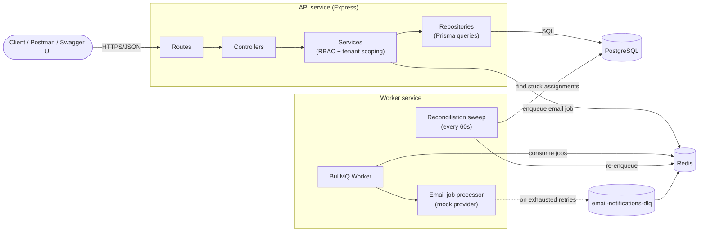
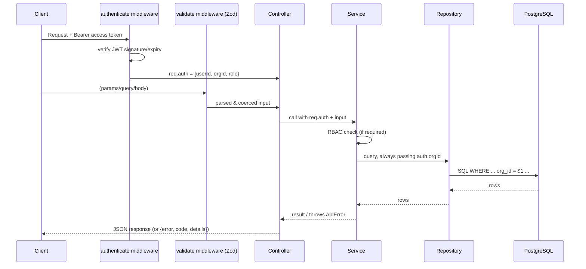
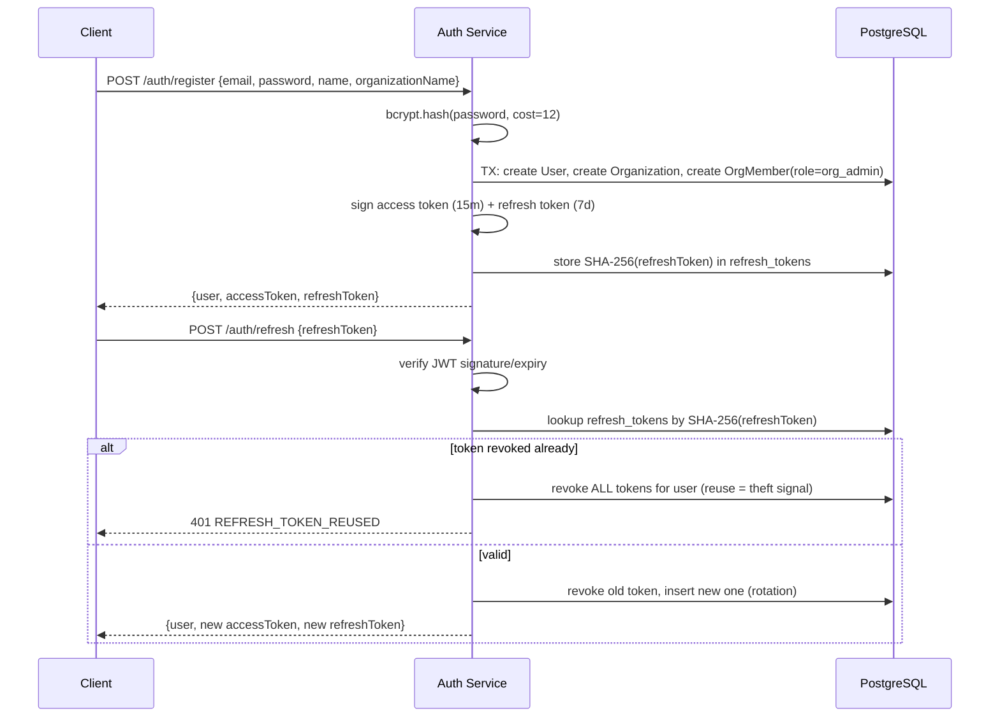
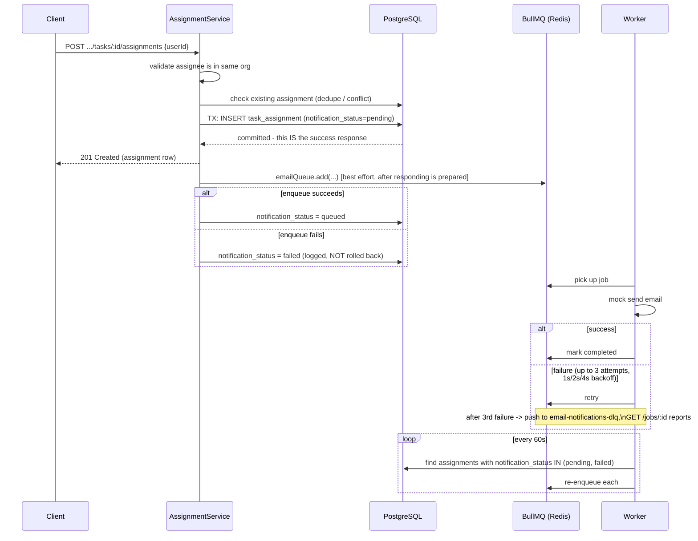
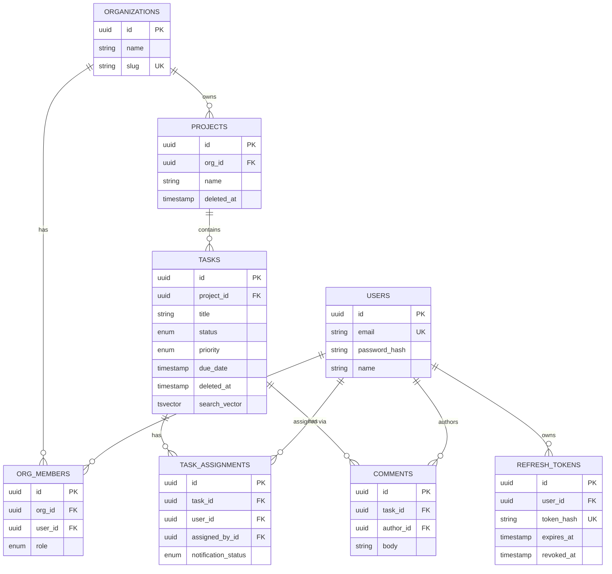

# TaskFlow - Architecture

## 1. System Components

- **API service**: stateless Express app (`src/app.ts`). Route → Controller → Service → Repository. Owns request validation (Zod), authentication/authorization, and all business rules. Talks to Postgres via Prisma and to Redis only to *enqueue* jobs / read job status (`GET /jobs/:id`).
- **Worker service**: separate Node.js process (`src/workers/index.ts`) running a BullMQ `Worker` that consumes the `email-notifications` queue, plus a periodic reconciliation sweep. Shares the same Prisma schema/client and codebase as the API, but is deployed and scaled independently.
- **PostgreSQL**: the single system of record for all tenant data (users, orgs, projects, tasks, assignments, comments, refresh tokens).
- **Redis**: backs BullMQ (job queue, retries, backoff, dead-letter queue) and nothing else - it holds no tenant data, only job state.

## 2. Request Flow (typical read/write)

`req.auth.orgId` and `req.auth.role` are read **only** from the verified JWT payload - never from the request body/query/params - which is what makes "do not trust client-provided org_id" structurally true rather than just a convention.

## 3. Authentication Flow

## 4. Task Assignment + Email Notification Flow

The assignment write and the queue enqueue are **not** wrapped in one atomic operation (Postgres and Redis cannot share a transaction). See the "Consistency strategy" section below for why that's the correct trade-off here, and `src/services/assignment.service.ts` for the implementation.

## 5. Multi-Tenant Isolation

- **Enforcement point**: the repository layer. `projectRepository` / `taskRepository` methods that read or write tenant data require `orgId` as a parameter and always include it in the Prisma `where` clause. There is no code path in the service layer that can query tasks/projects without supplying the caller's org.
- **403 vs 404 without leaking data**: `projectService.getOrThrow` / `taskService.getOrThrow` first do an org-scoped lookup; if that misses, they do a second, *unscoped* existence check purely to decide which error to throw (`404` if it truly doesn't exist anywhere, `403` if it exists in a different org) - the unscoped lookup's result is **never** serialized into the response.
- **RBAC**: `org_admin` vs `member`, checked in the service layer (`requireOrgAdmin`) before any mutation that's admin-only (delete project, manage members).

## 6. Database Relationships

Full CASCADE/RESTRICT rationale per relation is in [README.md §5](./README.md#5-database-design) and inline in `prisma/schema.prisma`.

## 7. Consistency Strategy for Assignment + Queue

Restated from the README for completeness, since this is one of the assignment's explicit "document your reasoning" requirements:

> **The task_assignment row in Postgres is the source of truth.** Once that INSERT commits, the assignment is real and the API returns success - no matter what happens to the email job afterward. Enqueueing into BullMQ/Redis is treated as a best-effort side effect: if it throws, we catch it, record `notification_status = 'failed'` on the assignment row, and log the error, but we do **not** roll back the assignment or fail the request. A background reconciliation sweep in the Worker process (every 60s, plus once at startup) scans for assignments stuck in `pending`/`failed` and retries enqueueing them, capped at 5 sweep attempts. This makes the *notification* eventually consistent while keeping the *assignment* - the operation the user actually asked for and is waiting on - immediately consistent and never blocked on Redis being healthy.

Trade-off accepted: a Redis outage at the exact moment of assignment delays that one email by up to ~60s (until the next sweep) rather than failing the assignment API call. Given email delivery is explicitly mocked/non-critical for this assignment, this is the right side to fail open on.

## 8. Important Design Decisions

- **Offset pagination**, not cursor-based (see README §19).
- **Registration self-creates an org** (registrant is `org_admin`); joining another org is an explicit admin action, never a public "join any org" endpoint.
- **Active org = most-recently-joined membership** at login/refresh time, since a full org-switcher UI/endpoint is out of scope.
- **Refresh tokens stored as SHA-256 hashes**, with rotation and reuse detection (revokes the whole session family).
- **Soft delete** (`deleted_at`) for `projects`/`tasks`; every repository read filters it out.
- **Full-text search** via a generated (`STORED`) `tsvector` column + GIN index, so PostgreSQL keeps it in sync automatically with no application-level trigger code.
